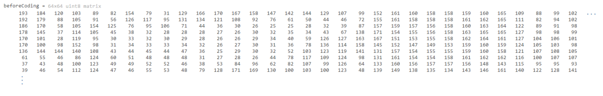
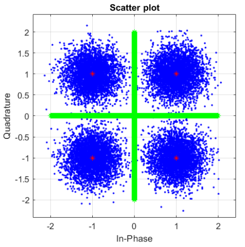

# Implementaion And Results

Here we provide a bit more details about the implementation of each block. Note that the images in the `pictures` folder are decimated by a factor of 8 so we can use a 64 x 64 image.

Some important parameters for design are the following:

| Parameter | Description | Value |
|:---------:|:-----------:|:-----:|
| $f_s$ | Sampling Frequency | 100 kHz |
| $T_s$ | Symbol Length | 10 ms |
| $f_c$ | Carrier Frequency | 10 kHz |
| $f_0$ | Channel Centeral Frequency | 10 kHz |
| $BW$ | Chanel Bandwidth | 5 kHz |

## The Source Encoder/Decoder Blocks
---

For encoding, the steps are fairly straightforward. We read the image pixel by pixel and count the occurrence of each symbol. We can then sort them in terms of theri frequencies as was mentioned in the previous part.

For splitting, we start from the first symbol in the group and keep adding symbols until the sum of the group exceeds the sum of the other group. Then we consider removeing the last element from the group. If the sums are closer then we will keep it this way, if not then we won't do this. In this way the two groups will have the least difference in terms of their frequency.

After this step, the symbols are split into a binary tree and the codewords are created.

For decoding, we could just start from the first bit and move on, since this is a prefix code, when we spot a codeword, we can just drag it out of the string and move on to the next. But there is a little problem here, noise!

In presence of noise, the prefix property is not enough to guarantee correct decoding. In the end we opt to add flags between the symbols, which decreases the data rate, but keeps the symbols distinct. After this, we will separate the flags and get the symbols. The decoded symbol will be the codeword with the least Hamming distance.

Here is an example of this process:

|  |
|:---------------------------------:|
| Original Pixels |

|  |
|:---------------------------------:|
| Encoded Pixels |

|  |
|:-----------------------------:|
| Encodeing / Decoding |

## Modulation / Demodulation
---

Here is how the modulation is done:
```Matlab
function modulated = minModule(m, fc, Tc, fs)
    if (m == 1 || m == 4)
        Amc = 1;
    else
        Amc = -1;
    end

    if (m == 1 || m == 2)
        Ams = 1;
    else
        Ams = -1;
    end

    t = 1/fs:1/fs:1/Ts
    modulated = Amc * sqrt(2/Ts) .* cos(2*pi*fc*t) + Ams * sqrt(2/Ts) .* sin(2*pi*fc*t);
end
```

The signal then passes through the channel and then reaches the demodulator:

```Matlab
function [out1,out2] = minDemodulateCorr(signal, fc, Ts, fs, phi)
    sample_times = 1/fs:1/fs:Ts;
    a = sqrt(2 / Ts);
    n = ceil(length(signal) / 2);

    s11 = a.*(cos(2*pi*fc*sample_times + phi)+sin(2*pi*fc*sample_times + phi));
    s12 = a.*(cos(2*pi*fc*sample_times + phi)-sin(2*pi*fc*sample_times + phi));
    s21 = a.*(-cos(2*pi*fc*sample_times + phi)+sin(2*pi*fc*sample_times + phi));
    s22 = a.*(-cos(2*pi*fc*sample_times + phi)-sin(2*pi*fc*sample_times + phi));

    c11 = sum(s11 .* signal);
    c12 = sum(s12 .* signal);
    c21 = sum(s21 .* signal);
    c22 = sum(s22 .* signal);

    c = [c11,c12,c21,c22];
    [~, i] = max(c);

    a_ap = xcorr(cos(2*pi*fc*sample_times), signal) ./ fs;
    b_ap = xcorr(sin(2*pi*fc*sample_times), signal) ./ fs;
    a_ap = a_ap(1, n) * 2 * a;
    b_ap = b_ap(1, n) * 2 * a;

    if i == 1
        Ac = 1; As = 1;
    end
    if i == 2
        Ac = 1; As = -1;
    end
    if i == 3
        Ac = -1; As = 1;
    end
    if i == 4
        Ac = -1; As = -1;
    end
    out1 = [Ac,As];
    out2 = [a_ap,b_ap]; % -> Ac As aprox.
end
```

Now, we have the amplitudes $A_{mc}$ and $A_{ms}$. So we can get the symbol index easily:

```Matlab
function m = detector(constellation)
    Ac = constellation(1,1);
    As = constellation(1,2);
    m = 0;
    if(Ac == 1 && As == 1)
        m = 1;
    elseif (Ac == 1 && As == -1)
        m = 4;
    elseif (Ac == -1 && As == 1)
        m = 2;
    elseif(Ac == -1 && As == -1)
        m = 3;
    end
end
```

## Channel
---

Here is how the channel is implemented, it is basically nothing but a bandpass filter.

```Matlab
function out = Channel(signal, fc, fs, w)
    fpassDown = fc - w/2;
    fpassUp = fc + w/2;
    out = bandpass(signal,[fpassDown fpassUp],fs);
end
```

You can see the effects in the fourier transform, here is an example:

| Input To The Channel | Output Of The Channel |
|:--------------------:|:---------------------:|
|  |  |

As you can see above, the transform gets *cut* after passing through the channel, causing distortion.

If you want a better look, here is the energy density spectrum after the channel:

<p align=center>
    
</p>

The red stars show the *99 percent of energy bandwidth*.

## Effects Of Noise
---

Noise is simulated as an additive, gaussian white noise. We control the SNR by increasing/decreasing the variance of the noise.

As the variance increases, the probability of error increases, causing the number of wrong pixels to increase. Here is an example of what happens when we increase the SNR:

<p align=center>
    
</p>

You can see the effects much better if we use the constellation diagram. Here we will plot 5 levels of noise for the same image:

| Original Image | Contellation Diagram |
|:--------------:|:--------------------:|
|  |  |
|  |  |
|  |  |
|  |  |
|  |  |

As you can see, as the SNR decreases, more and more symbols have a chance of crossing the boundries between the 4 centroids (the thick, green lines) and thus the modulators will deduce the correct symbol worng. This is how the pixels can change after detection.

But there is also, another effect. One that is arguably much more concerning, and that is *phase shifts*.

## The Effects Of Phase Shifts
---

If the receiver and the transmitter are not synced, and have a phase difference of $\Phi$, then the signal that comes out of the channel is of the form:
$$
    y = A_{ci} \cos(2 \pi f_c t + \Phi) + A_{mi} \sin(2 \pi f_c t + \Phi)
$$

In this case, the correlation with the symbol $S$, which we call $D$, will be:
$$
    \begin{aligned}
    D = R & (A_{ci} \cos(2 \pi f_c t + \Phi) + A_{mi} \sin(2 \pi f_c t + \Phi), S) = \\
          &(A_{ci} \cos(\Phi) + A_{mi} \sin(\Phi)) \;\; R(\cos(2 \pi f_c t), S) + \\
          &(A_{mi} \cos(\Phi) -A_{ci} \sin(\Phi)) \;\; R(\sin(2 \pi f_c t), S)
    \end{aligned}
$$

Now, remember that each symbol was of the form:
$$
    S = A_{cj} \cos(2 \pi f_c t) + A_{sj} \sin(2 \pi f_c t)
$$

Replacing $S$ in $D$:
$$
    D = \frac{A_cj}{2} (A_{ci} \cos(\Phi) + A_{si} \sin(\Phi)) + \frac{A_{mj}}{2} (A_{mi} \cos(\Phi) - A_{ci} \sin(\Phi))
$$

For this detector, the output should maximize the value of $D$, if we treat $D$ as a function of $\Phi$ we have:
$$
    D = \frac{\sqrt{2}}{2} (A_{cj} \sin(\Phi + \tan^{-1}(\frac{A_{ci}}{A_{si}})) + A_{sj} \sin(\Phi + \tan^{-1}(\frac{A_{si}}{-A_{ci}})))
$$

Now, define:
$$
    \alpha := \tan^{-1} (\frac{A_{ci}}{A_{si}})
$$

Then:
$$
\begin{aligned}
        D(\Phi, \alpha) =   \frac{\sqrt{2}}{2} (A_{cj} \sin(\Phi + \alpha) + A_{sj} \sin(\Phi + \pi - \tan^{-1}(\frac{A_{si}}{A_{ci}}))) & = \\
                            \frac{\sqrt{2}}{2} (A_{cj} \sin(\Phi + \alpha) + A_{sj} \sin(\Phi + \frac{\pi}{2} + \alpha)) & = \\
                            \sin(\Phi + \alpha + \tan^{-1}(\frac{A_{sj}}{A_{cj}})) &
\end{aligned}
$$

Now, using the definition of each amplitude we will have:
$$
    \tan^{-1}(\frac{A_{sj}}{A_{cj}}) = (2j - 1) \frac{\pi}{4} \\
    \alpha = \frac{\pi}{2} - (2i - 1) \frac{\pi}{4}
$$

So finally:
$$
    D(\Phi, i, j) = \sin(\Phi + \frac{\pi}{2} + \frac{\pi}{4} (2j - 2i)) = \cos(\Phi + \frac{\pi}{2}(j-i))
$$

This is interesting, since as the phase difference increases, *changes happen very abruptly*. We need to choose $j$ such that for each $i$, the value of $D$ is maximized, and if $\Phi$ is nonzero, symbols can *spin*.

Here is an example, if the original symbol was $i=1$ and $\Phi=\frac{\pi}{2}$, what we will see that $D = \cos(\frac{\pi}{2} j)$ and this means that $j=4$!! Similarly, symbol 2 will now be mapped to 1, 3 to 2 and 4 to 3, literally everything that could have gone wrong, has gone wrong!! And this doesn't even depend on the noise! You could have used the best channel in the universe and the output would still be a complete mess!

The interesting fact is that it also happens very abruptly, here is our example for phase differences of 0, 15, 30 and 60:

| Output Image | Constellation |
|:------------:|:-------------:|
|  |   |
|  |   |
|  |   |
|  |   |