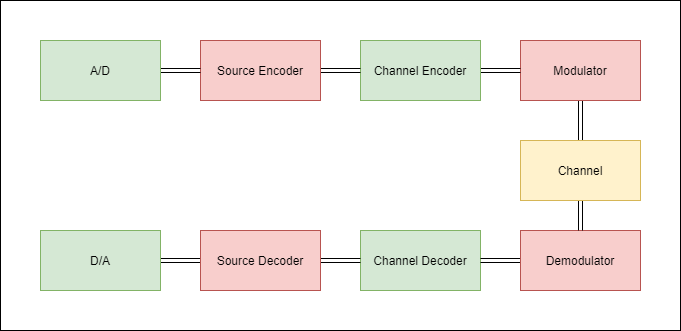

# Introduction

A digital communication system is to be modeled like the following:

    

In this project, all data is assumed to be digital, so we can ignore the A/D and D/A blocks. Since we are trying to test the performence of source coding with modulators, we won't be using any error correction code and hence no channel coding is needed also.

For source coding, we will use *Shannon-Fano* coding which will help compress the data that we will send. For modulation, simple *QAM* modulation will be used. Both of these will be discussed in the coming sections.

## Shannon-Fano Source Coding
---

Source coding, in general is a way to compress data by mapping information into a series of symbols (like bits), while trying to preserve integrity and prevent the loss of data. Sometimes we may also use it to simplify the source signals so we can use it in  more efficient manner.

Shannon-Fano source coding (although Shannon and Fano came up with *similar* codes, they differed a bit) is a famous example of source coding. It is also an efficient, yet suboptimal ***prefix code***. This means that no valid codeword appears as a prefix of any other valid codeword. This allows us to decode a string of codewords given the codebook very easily.

For encoding, the algorithm needs to do two things:
- Actually produce a prefix code
- Try to compress the source

The first one is surprisingly easy, one way to do it would rely on the fact that given two prefix codes $\mathcal{C}_1$ and $\mathcal{C}_2$, the code:
$$
    \mathcal{C} = \{0.c | c \in \mathcal{C}_1\} \cup \{1.c | c \in \mathcal{C}_2\}
$$

is also a prefix code (you can prove this by assuming the opposite and arriving at a contradiction).

So if we can come up with a set of two prefix codes, we can combine them as many times as we want to get a code that is large enough for our symbols. A trivial starting set would be $\{0\}$ and $\{1\}$. 

There is a problem though, in what manner should we split the code? should we just split them in half each time? Well this depends on your goals, for the purpose of *data compression*, you should consider things like the *length* of each code ...

Shannon and Fano came up with a simple idea:
> Symbols with the highest frequency of occurrence should have the shortest codes.

So we need to count the symbol frequencies of the source, this can be done easily, then the symbols have to be sorted and the mapping can start.

The full algorithm is like this:

1. Create a list of relative frequencies (or probabilities) from the symbols in the source.
2. Sort this list in a decreasing order.
3. Split the list into two groups, such that the frequency of each group is as close as possible.
4. Concatenate a single 0 and 1 to the first and second group respectively.
5. Repeat steps 3 and 4 until each group breaks down to groups of length 1.

### Example
Imagine the freq. of our source obeys the following:

| Symbol | Probability |
|:------:|:-----------:|
| A | 0.35 |
| B | 0.26 |
| C | 0.15 |
| D | 0.14 |
| E | 0.10 |

The first split would be $\{A, B\}$ and $\{C, D, E\}$, the codes will be $\{0\}$ and $\{1\}$.

The second spli will give $\{A\}$, $\{B\}$, $\{C\}$ and $\{D, E\}$ with codes $\{00, 01\}$ and $\{10, 11\}$.

The final split will just give $\{D\}$ and $\{E\}$ and the codes will be $\{110, 111\}$ for them, so the codebook is:

| Symbol | Code |
|:------:|:----:|
| A | 00 |
| B | 01 |
| C | 10 |
| D | 110 |
| E | 111 |

### Sidenote
As I said earlier, this code is *suboptimal*, in the sense that it does not generate the code with the shortest expected length (although it would be at most 1 bit off in that regard). See [Huffman Coding](https://en.wikipedia.org/wiki/Huffman_coding) if you are interested.

This is all pretty easy to implement, so we'll just move on.

## Modulation
---

We'll use simple QAM modulation here.

$$
    S_m = 
    \begin{cases}
        A_{mc} \sqrt{\frac{2}{T_s}} \cos({2\pi f_c t}) + A_{ms} \sqrt{\frac{2}{T_s}} \sin({2\pi f_c t}) & 0 \leq t \leq T_s \\
        0 & O.W.
    \end{cases}
$$

Where:

$$
    A_{mc} = 
    \begin{cases}
        1 & m = 1, 4 \\
        -1 & m = 2, 3
    \end{cases}
$$

$$
    A_{ms} = 
    \begin{cases}
        1 & m = 1, 2 \\
        -1 & m = 3, 4
    \end{cases}
$$

Given an AWGN channel, detection is fairly easy. Note that all the symbols have the same energy, so optimal detection of the signals location in the constellation from the received symbol $y$ can be doen with just a simple dot product:

$$
    j = \argmax_{i \in \{1, 2, 3, 4\}} <y, S_i>
$$

And having found $j$, the amplitudes can be found right away.

### Sidenote:

You could in theory do the following (I am using the Gabor representation of the noise):
$$
    y = A_{mc} (\sqrt{\frac{2}{T_s}} + n_c(t)) \cos({2\pi f_c t}) + A_{ms} (\sqrt{\frac{2}{T_s}} + n_s(t)) \sin({2\pi f_c t})
$$

Now, you can use the Hilbert transform of the signal $\hat{y}$ and write:
$$
    A_{mc} \sqrt{\frac{2}{T_s}} + n_c(t) \approx y \cos(2 \pi f_c t) + \hat{y} \sin(2 \pi f_c t) \\
    A_{ms} \sqrt{\frac{2}{T_s}} + n_s(t) \approx y \sin(2 \pi f_c t) - \hat{y} \cos(2 \pi f_c t)
$$

Now just check the sign:
$$
    A_{mc} = sign(y \cos(2 \pi f_c t) + \hat{y} \sin(2 \pi f_c t)) \\
    A_{ms} = sign(y \sin(2 \pi f_c t) - \hat{y} \cos(2 \pi f_c t))
$$

Why all the trouble though? Well this method is *very* robust and you'll need really really high levels of noise to make it decide wrong, but the real problem is the Hilbert transform ...

Our symbols are not pure sine and cosine, they are sines and cosines multiplied with a *pulse*, since they have to be limited in time. So the Hilbert transform won't come out as we expect it to, so we won't use this method here.

### How To Plot The Constellation?

This depends on how we extract the amplitudes, we want a close approximation to the original signal with this:
$$
    S = \widetilde{A_{mc}} \sqrt{\frac{2}{T_s}} \cos(2 \pi f_c t) + \widetilde{A_{ms}} \sqrt{\frac{2}{T_s}} \cos(2 \pi f_c t)
$$

by adjusting $\widetilde{A_{mc}}$ and $\widetilde{A_{ms}}$.

One way would be like this:
$$
    \widetilde{A_{cm}} = \sqrt{\frac{T_s}{2}} R(S, \cos(2 \pi f_c t)) \\
    \widetilde{A_{sm}} = \sqrt{\frac{T_s}{2}} R(S, \sin(2 \pi f_c t)) \\
$$

Where $R(., .)$ is the correlation operator.