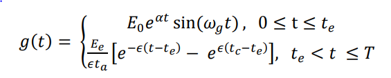
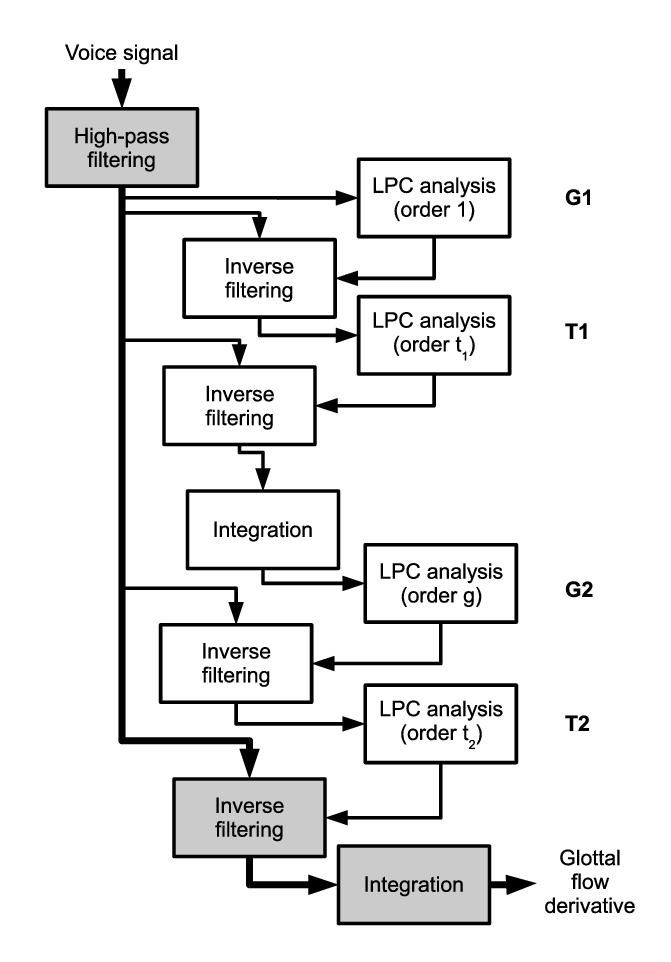

# Glottal Pulse Extraction and IAIF

This section is devoted to the implementation of the IAIF alogorithm and the process in the paper.

## The LF model
---

The *Liljencrants-Fant* model is pretty common in modeling the Glottal pulse.
The model starts by defining a curve that can be tuned with certain parameters in it's definition; a curve-fitter can then use this model to estimate certain parameters in the Glottal pulse after it is extracted from the sound samples.

The model is:

Each parameter comes from emperical observations based on the extracted pulse, here is an illustration:

After the curve-fitter has done it's job, the final attributes can help evaluate each parameter about the Glottal pulse. But before that, the pulse itself needs to be extracted ...

## IAIF
---

*Iterative Inverse Adaptive Filtering* is a common way to extract a periodic pulse after it is processed through some arbitrary linear, rational system.

The base of the method relies on inverse LP coefficients.
This is done by:
- Performing a low level LP analysis on the input signal, this extracts the envelope of the Glottal pulse, but it will miss many of the high freq. features.
- The low freq. compents are then removed by passing the signal through an inverse filter using the previous cofficients.
- At this point, the effects of the source have been removed, a high order LP analysis can be carried out that will extract the Vocal Tract filter from the signal; by applying and inverse of this filter, the *derivative* of the Glottal pulse is extracted.
- An integration is carrried out using a simple filter, the Glottal pulse is then reconstructed.

Here is a diagram of the process:

There is still the choice of the low and high order of each LP analysis. To this end, we used the reference in the README file, the final decision was:

| Low order LP | High order LP |
|--------------|---------------|
| 5 | 40 |

These are referred to as *GLOTTAL_LPC_ORDER* and *VOCOAL_TRACT_LPC_ORDER* in the code.