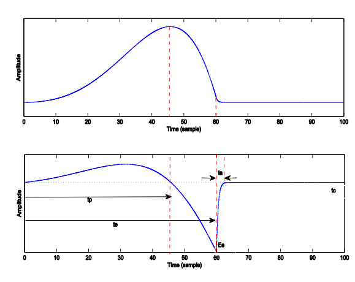

# Extracted Parameters
This section explains the extracted parameters in the paper.
Each parameter will be described in a separate section.

We will be referring to this picture a lot in this script:

## T
---

The pitch period, this goes without saying basically, since everything depends on it.

There are many studies that show that when people develop PD, their ability to control the pitch frequency withers away. So some of the parameters try to measure the variance and fluctuation in this quantity.

Pitch can be easily found after IAIF has finished doing it's work, just find the mean peak-to-peak interval.

## QOQ
---

Defined from $T, t_{q_1}$ and $t_{q_0}$. These are defined as:

- $t_{q_0}$: The time interval that the pulse is above half of it's maximum value.
- $t_{q_1}$: The time interval that the pulse stays lower than half of it's maximum value.

The difference is then normalized by $T$, so:

$$
QOQ := \frac{t_{q_1} - t_{q_0}}{T}
$$

## NAQ
---

Defined as:

$$
NAQ := \frac{A}{E_e . T}
$$

Where $A$ is defined as *the maximum absolute value of the pulse* (this definition comes from us basically, in orther to use the one in the paper, curve-fitting to LF model in necessary which we want to avoid).

## $t_e$ and $t_p$
---

These can be inferred from the above image, as:

- $t_e$: The time it takes for the pulse to go from rest to maximum.
- $t_p$: The time it takes for the pulse to close after it has come to rest.

The first one can be found from the pulse itself, for the second one, we will find the minima of the pulse derivative instead.

## $R_k, R_g$
---

These follow the same logic as of QOQ and NAQ:

$$
R_g := \frac{T}{2t_p} \:\:\:\: R_k := \frac{t_e - t_p}{t_p}
$$

## $E_e$
---

This comes from the LF model, it is the value of the pulse derivative when the pulse closes (the absolute value of the derivative when it reaches it's minimum).

This parameter depends on the intensity and amplitude of the pulse which differs significantly between samples. So a Min-Max scaling is done before using the samples.