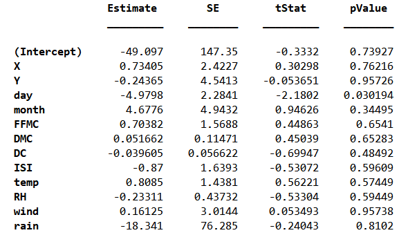

# Simple Regression Test

As mentioned before, the previous problem was entirely discrete, and while even if some features were continuous, we might not necessarily have been in trouble, when it comes to *predicting a continuous feature*  we need some reevaluation.

To this end, we now have a regression problem at hand. Once again we are going to test this on a real dataset, this time on the `forest fires` dataset, which is data about the conditions which could have caused a fire in the forests.

You might wish to also check the main paper, [A Data Mining Approach to Predict Forest Fires usin Meteorological Data](http://www.dsi.uminho.pt/~pcortez/fires.pdf), if this is your first time working with regressors or classifiers, this paper would probably be interesting, if you have knowledge about SVMs this also might show some interesting applications.

## The Dataset
---

The dataset consists of the following:

| Feature Name | Feature Description |
|:------------:|:-------------------:|
| X | x-axis spatial coordinate within the Montesinho park map |
| Y | y-axis spatial coordinate within the Montesinho park map |
| month | month of the year, "jan", "feb", ..., "dec" |
| day | day of the week, "sat", "sun", ..., "fri" |
| FFMC | index from the FWI system |
| DMC | DMC index from the FWI system |
| DC | DC index from the FWI system |
| ISI | ISI index from the FWI system |
| temp | temperature in Celsius degrees |
| RH | relative humidity |
| wind | wind speed in km/h |
| rain | outside rain in mm/m2 |
| area | the burned area of the forest (in ha) |

## Implementation
---

The bulk of the process is just like the previous example, that is just loading the dataset and converting to numerical.

For the rest of the work however, we need a regressor. Here we just used the simple linear regressor in MATLAB.

Might be worth it to talk about it a bit ...

We are telling the regressor that we *believe* that variables $x_1, x_2, ..., x_n$ play a role in the final value of the variable $y$. Each of these variables may also have some noise attributed to it.

Assuming thatwe could right $y$ as:

$$
    Y = \sum_{i=1}^{i=n} a_i X_i + \mathcal{N}
$$

Where the R.V. $\mathcal{N}$ is some noise. We are interested in the following:

- How much do each variable $X_i$ effect the result?
- How accurate is this model after all ***ineffective*** variables have been removed?

To answer the first question, we can refer to the T-test that we just learned about, here is the ***Null*** hupothesis:

> $H_0$: The coefficient $a_i$ is 0

If this hypothesis cannot be falsified with a given significance level (often 0.05), we would be unable to provide concrete evidence that $X_i$ is an ineffective variable, which means that we cannot say that it should be removed, so we (or more specifically MATLAB) will keep it in it's model.

The second question can go alot deeper than what we have done, there is simple *F-test* that can attribute a p-value to your model, but we just ignored it here and prefer to just go with a simple error value on the dataset.

To implement this, it is as easy as just:

```matlab
    lm = fitlm(train);          % Get the model
    fit = lm.Fitted;            % Get the data
    pred = lm.predict(test_x);  % Predict on test data
```

MATLAB can also just give you much more detailed results, if you call your model in the command line:

```
    >> lm
```

You'll get a summary of the model, like this:

<p align=center>

</p>

Curiously, of all the different variables in the model, ***day*** turns out to be the only significant one, since it's p-value is smaller than 0.05! (you might not see this though, the train and test data are shuffled ... but this variable always comes on top most of the time).
