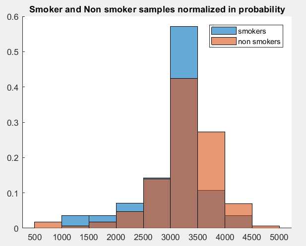

# Simple T-test

This question is much more educational in it's purpose, more like a warmup for the later implementations.

Basically, we are going to do a simple hypothesis test about a an assumption, and see how much it holds true against some empirical evidence. 

A T-test is a good place to start here, since the assumption of normal distribution isn't unreasonable.

## So what is the problem
---

We are working with the *California_birth_1* dataset, this dataset is a subset from a more general dataset (which you can find many of them at [Kaggle](www.kaggle.com)) and is concerned with the following question.

> Does smoking cause the mean weight at birth to change significantly?

This is the question that we are trying to answer, statistically.

## The dataset
---

It consists of 200 random samples, the main variables are:

|Variable Name| Variable Function  |
|--|--|
| mage | The age of the mother |
| tgrams | The weight of the infant in grams
| smoke | does the mother smoke during pregnancy? (0: No , 1: yes)
| weeks | pregnancy duration in weeks |

We don't expect the other variables to play a role in our current model (this is a preposition, it could be wrong!).

Before we go further, a little review ...

## T-test
---

What we are trying to do, is a comparison between two distribution means. However the data is only a small sample if this bigger distribution, thus any inference on the dataset is going to have at least a bit of error, however our concerns are about *uncertainty* not errors.

This is something that we can actually talk about in a pretty precise manner in terms of distributions and tests,  but we still need some assumptions.

Given a sample mean of $\bar{X}$, if the parent distribution is normal with a mean of $\mu$ and a variance of $\sigma^2$, the sample mean obeys a $N(\mu, \frac{\sigma^2}{n})$ distribution. If we knew the variance, a test statistic like:

$$
t = \frac{\bar{X} - \mu_0}{\sqrt{\frac{\sigma^2}{n}}}
$$

would be obey a normal distribution, if $\mu_0$ is very close to $\mu$. So we can test the validity of the null hypothesis and alternative hypothesis:

$$
H_0: \mu = \mu_0 \\
H_a: \mu \neq \mu_0
$$

But we don't know the variance, so we need to modify this test a bit. The T-test will help with that. Under the Null hypothesis, we expect that:

$$
t = \frac{\bar{X} - \mu_0}{\sqrt{\frac{s^2}{n}}} \sim t(n-1)
$$

This is for one distribution, our case deals with two, the distribution of smokers, and non-smokers. Bare in mind that the populations are not paired, they may even differ significantly in terms of size. 

The Welch test is the generalization of T-test in this instance. Given two distribution sample means of $\bar{X}_1$ and $\bar{X}_2$ and sizes $n_1$ and $n_2$, under the Null hypothesis of *"the populations have insignificant difference in mean"* we have:

$$
t = \frac{\bar{X}_1 - \bar{X}_2}{\sqrt{\frac{s_1^2}{n_1} + \frac{s_2^2}{n_2}}} \sim t(\nu)
$$

Not exactly, but very close ... . Here the $\nu$ parameter can be found from:

$$
\nu = \frac{(\frac{s_1^2}{n_1} + \frac{s_2^2}{n_2})^2}{\frac{s_1^4}{n_1^2 (n_1 - 1)} + \frac{s_2^4}{n_2^2 (n_2 - 1)}}
$$

This is what we'll need. Some simple tests can be done now given a significance level, almost always we are going for a level of 0.05.
# Examples
**Q**: The mean age for birth among the tested mothers is larger than 25.

We construct the Null hypothesis of *"The mean age is smaller than 25"*, if the test fails, we have significant evidence to support that this hypothesis is false and thus the above assertion is correct.

For the test, just use the simple T-test will suffice. We turn out to be lucky and the distribution has quite a lot of bias from the test results, the p-value is much less than 0.05 and thus the hypothesis can hold true.

**Q**: The mean duration of pregnancy in weeks, is lower than 39.

It is basically the same, just different values, we once again are lucky and the distribution turns out to be biased towards the left, so this statement can also be partly true.

## The last argument
---

Returning to the problem about smoking and weight after birth, we are faced with a different problem. Our samples are two different unknown distribution and we don't know the variance of either. The number of test samples also differs significantly.

|# smoking samples| # non-smoking samples |
|--|--|
| 28 | 172 |

So we need the Welch test here. Upon testing you can see that the distributions differ in center and with this significant level, the distribution of smokers leans to the left, reinforcing the hypothesis that smoking does have a correlation with less weight.

You can actually see this a bit in the plots.

