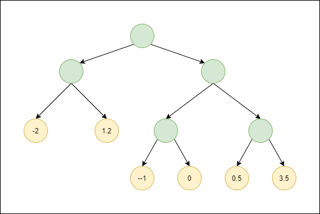

# Introduction

A little background about the paper.

We have a monkey, which is supposed to be our decision-making entity, who we are training to recognize some patterns. A set of 10 objects have been created that we are going to use in this experiment; each object is given some value known only to the experimenter.

Now, each experiment consists of several *steps*, at each step, the experimenter pulls out 4 of the 10 aforementioned objects, and through some logic, associates a number of 0 or 1 to this set. We will call this value *Ground Truth* or GT in the code.

Now, the monkey will be shown the objects and it will now through some decision-making process of it's own, choose an output of either 0 or 1. The experimenter records the monkeys answers and performs the test a few more steps. In the end the experimenter through a fixed logic, determines whether to reward the monkey, or punish it.

The monkey will try to learn in such a way that would allow him to maximize their reward. This envolves deducing what how the experimenter assigns GT values based on the objects, and how the experiment is actually carried out in steps.

With this out of the way, we can now talk about the modeling of our problem.

## Experiment Design
---

The experiment is to be modeled like the following.

A set of 10 objects $\mathcal{O}$ and a bijection $f_v: \mathcal{O} \rightarrow \{0, 1, ..., 9\}$ are given to us. The bijection is effectively the *value function* of the objects, assigning each object a numerical value. In the implementation, the objects are not important and hence we can just focus on the rest of the experiment.

An emulator entity $E = \{\mathcal{T}, f_g\}$ is agrred upon, where $f_g$ is a function that combines the values of 4 objects into a GT value.

$\mathcal{T}$ is a binary tree whose terminals (leaves) are assigned certain reward values. The tree can be atbitrarily deep, but at each level, the transition to the next level is determined by the action of the monkey and weather or not it equals GT at that step or not.

Last, we have the monkey itself which we call $\mathcal{M}$. 

$\mathcal{M}$ is an algorithm that tries to interpret shapes that are randomely given to it, it also receives a bit more information from the emulator, namely the current level of the tree. The algorithm outputs a value of 0 or 1 at each step.

The experiment starts at the root of $\mathcal{T}$. At each non-terminal step, the emulator randomely pulls out 4 objects out of $\mathcal{O}$ and calculates their values using $f_v$. These values are then passed to $f_g$ and the current GT value, $G$, is calculated.

The emulator now passes the current level in $\mathcal{T}$ and the objects to $\mathcal{M}$ and then receives an output $G_M$. The next node in the tree is chosen by weather or not $G_M = G$.

The experiment ends when the monkey finally navigats it's way to one of the terminals and gets a reward, which can be positive (actual reward) or negative (punishment).

The monkey will now try to maximize it's reward.

## The Experiment In Our Implementation
---

We need only specify the emulator to describe the eperiment.

The objects are just numbers in $\{0, 1, ..., 9\}$ and $f_v$ is an identity mapping. For $f_g$, the implementation is simple:

```Python
    if self.step == 1:
        GT = float((np.sum(self.stimuli) / (num_objects * num_stimuli)) < self.criterion)
    else:
        GT = float((np.sum(self.stimuli) / (num_objects * num_stimuli)) > self.criterion)
```

So basically, the average value of the objects, is devided by 10 and compared to a threshold (which is always 0.5 by the way). Based on what step we are in, the decision will be made.

Next we need to specify $\mathcal{T}$. We just went with this random graph here.

<br>
<p align=center>
    
</p>