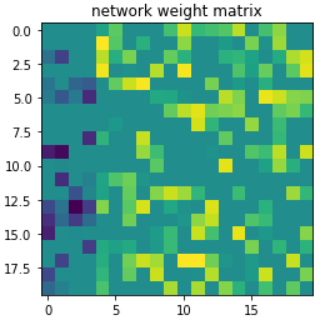
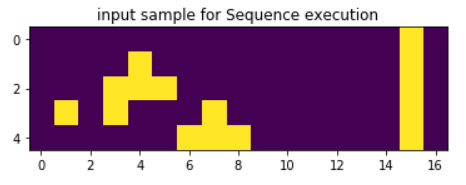
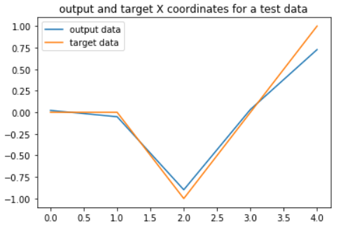
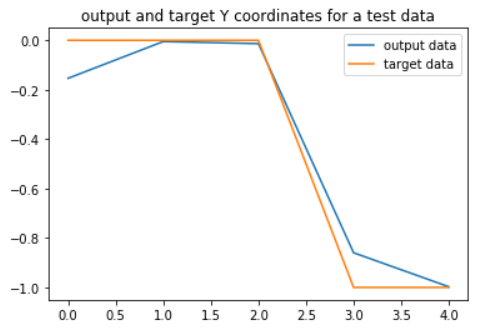
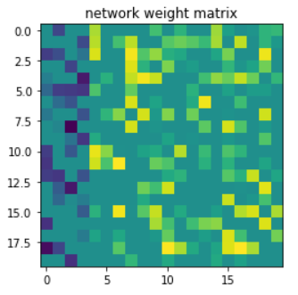
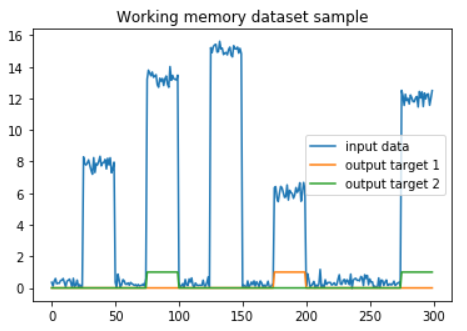

# List Of Cognitive Tasks

Here we'll be talking about the tasks in the paper, these include the following:
- Two *perceptual cognitive tasks* where the neurons are supposed to track an input value as best as they can. The duration of these input pulses can be fixed or varied.
- A *sequence execution* task. Imagine you are on 3 by 3 grid, you start numbering the grid with 1, 2, ..., 9 in row-major order. You start in the middle (section 5) and start moving to other sections. The neuron will be trained on certain sequences of mevement between these sections, then during tests, we will ask it to repeat these movements given the number of that sequence.
- A *parametric working memory* task. Two signals are given to the neuron, which will have two outputs, during each trial the neuron will be asked to say which signal is bigger, and then it has to set the output corresponding to that signal to high.

## Perceptual Cognitive Tasks
---

### Dataset
The Dataset is easy enought to build, at each step we'll generate for example, 100 points, and then we'll flip a coin to decide which on of the two signals is supposed to be high this time. Then we'll add some noise and then we are done.

A *silence* period is always inserted before excitation (for example, 10 percent of the whole duration, which will be 10 points) to allow the network to recover from the previous input values and create memories.

For both fixed and variable length datasets, we'll keep the number of samples fixed (100). For the fixed duration, we'll set the *duty cycle* of the pulse to a fixed value (like 0.9), for the variable length, we'll put a tolerance of 0.3 around 0.5, so we'll get uniform distribution of duty cycles in ht einterval $[0.2, 0.8]$ which we shall sample in each test.

### Examples
Here is an example for the fixed duration:

  
  
  

Here is an example for the variable durations:

  
  
  

The matrices should also obey the criterions we mentioned, here is how they look:

Fixed Duration | Variable Duration
:-------------:|:-----------------:
 | 

These matrices use 20 neurons.

## Sequence Execution Task
---

### Dataset
The paper implements this task in the following manner.

There are 8 sequences that the network must learn, so we'll need an 8 bit one-hot vector for this at the very least.

The next thing we'll need are correct movements, to do this, the paper has suggested this:
- Encode the position in the number of the grid, which is 1, 2, ..., 9 (so 9 bits in a one-hot representation) and assume that the sequence always starts at 5 (the middle section).
- In each transition, set the two possible sections that network can move to, to high.

So for example, sequence number 7 is the following: 

$$
  5 \rightarrow 
  4 \rightarrow 
  8 \rightarrow 
  7
$$

So we need to set the sequence bit number 5 to high, and then give the instructions. 
- If we move from 5 to 4, the opposite direction will be 6, so 4, 5, 6 will be set to high.
- After we move to 4, our next step is 8, the opposite will be 3, so 3, 4, 8.
- Finally, the next step in a similar manner will be 7, 8, 9.

This will be the pattern for this particular sequence, there will be 7 more of them that can be created in a similar manner.

In the end, the x and y coordinate will be extracted from the pattern and compared to the expected pattern as a measure of loss (we can't compare the section number sequences, because say you are at 2, and need to go to 3, you may go to 1 or 5 if you decide wrong, but the punishments are too different, despite this being just *one* wrong move!).

All of these will be extracted and kept in the dataset.

### Examples

Here is how the pattern for sequence number 7 looks like:

And for the outputs, here is an example for the previous pattern:

X Coordinate | Y Coordinate
:-------------:|:-----------------:
 | 

Once again, we expect to see a weight matrix that looks right.

## Parametric Working Memory Task
---

Here, the signal levels can be varied, the neuron needs to learn to *compare*, it does not need to gain any knowledge about the levels by themselves.

Data generation is very much like task 1, instead we need stack the signals together. The noise here is much smaller though.

Here is an example of what you'll see in the dataset:

